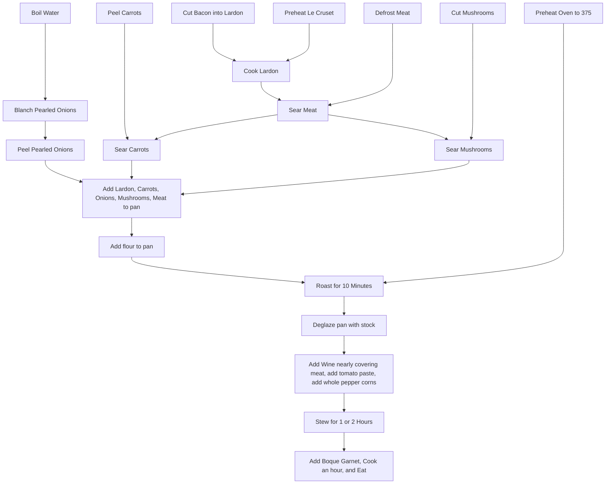

# Beef-Burgundy
Documenting the cooking process using software engineering techniques

## Diagrams

### Flow Chart

```mermaid
flowchart TD
A1[Boil Water]
A2[Cut Bacon into Lardon]
A4[Preheat Le Cruset]
A5[Peel Carrots]
A6[Cut Mushrooms]
A7[Defrost Meat]
A8[Preheat Oven to 375]
B1[Cook Lardon]
B3[Blanch Pearled Onions]
D1[Peel Pearled Onions]
D2[Sear Carrots]
D3[Sear Mushrooms]
C1[Sear Meat]
G1[Add Lardon, Carrots, Onions, Mushrooms, Meat to pan]
H1[Add flour to pan]
J1[Roast for 10 Minutes]
K1[Deglaze pan with stock]
L1[Add Wine nearly covering meat, add tomato paste, add whole pepper corns]
N1[Stew for 1 or 2 Hours]
O1[Add Boque Garnet, Cook an hour, and Eat]
A1---->B3
B3-->D1
A2--->B1
A4--->B1
A5----->D2
B1-->C1
C1-->D2
C1-->D3
A6----->D3
A7---->C1
D1-->G1
D2-->G1
D3-->G1
G1-->H1
H1-->J1
A8-------->J1
J1-->K1
K1-->L1
L1-->N1
N1-->O1
```

